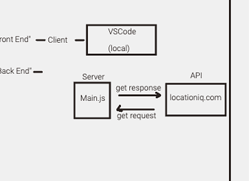

# Lab 6: Asynchronous Coe, and APIs

# City Explorer

**Author**: Kao Saelor

**Version**: 1.0.0 (increment the patch/fix version number if you make more commits past your first submission)

## Overview
This project is a React project using Axios to access a third-party API. Planning is done with a partner, implementation is independent, and Trello is used for project management. User stories with acceptance criteria and checklists are used for features, with the Location IQ Geocoding API selected. 

## Getting Started
To build the app on their machine, the user must create a new React project, install Axios to access the LocationIQ API, obtain an API key, and use Trello for project management. The app's components should be developed to request and render the API data, and can be tested with npm start.

## Architecture
The application design is built with React and Bootstrap for the user interface, and Axios for making requests to the LocationIQ API. Trello is used for project management. The app is structured with reusable components and uses props to pass data. It is designed to be responsive and user-friendly, with a focus on presenting location data clearly.

## Change Log
04-17-2023 1:00pm - Set up React repository & API keys.

04-17-2023 3:00pm - Created input form for user to input City with submit button and generate longitude and latitude coordinates. 

04-17-2023 4:00pm - Able to render map when user puts in valid City.

04-17-2023 6:00pm - Errors code for City name has been coded and is fully-functional.

04-17-2023 8:00pm - Application is fully-functional with styling. 

## Credit and Collaborations
Instructors: Aubrey Patterson & JB Tellez

TA: Tammy D. and Raul Z.

Teammates: Kenya W., Coriana W., Isabel S., and Hayden C. 

# Lab 7
**Time Estimates** 

For each of the lab features, make an estimate of the time it will take you to complete the feature, and record your start and finish times for that feature:

Name of feature: Lab 6 Feature 1 - 4

Estimate of time needed to complete: 4 hours

Start time: 1:30 pm

Finish time: 8:30 pm

Actual time needed to complete: 7 hours

## WRRC

## Lab 8
**Time Estimates**

For each of the lab features, make an estimate of the time it will take you to complete the feature, and record your start and finish times for that feature:

Name of feature: Lab 8 Feature 1 - 3

Estimate of time needed to complete: 6 hours

Start time: 1 pm

Finish time: 10 pm

Actual time needed to complete: 9 hours

## WRCC

## Lab 9
**Time Estimates**

For each of the lab features, make an estimate of the time it will take you to complete the feature, and record your start and finish times for that feature:

Name of feature: Lab 9 Feature 1 - 2

Estimate of time needed to complete: 4 hours

Start time: 1 pm

Finish time: 6 pm

Actual time needed to complete: 5 hours

## WRCC

## Lab 10
**Time Estimates**

For each of the lab features, make an estimate of the time it will take you to complete the feature, and record your start and finish times for that feature:

Name of feature: Lab 9 Feature 1 - 2

Estimate of time needed to complete: 4 hours

Start time: 1 pm

Finish time: 6 pm

Actual time needed to complete: 5 hours

## WRCC

